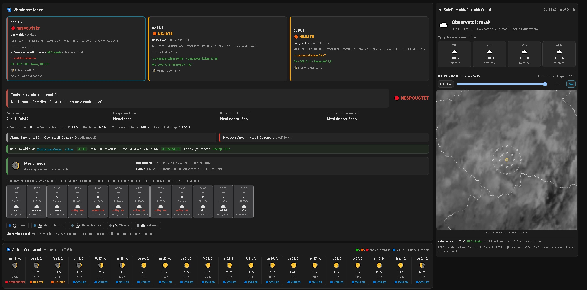

# Home Assistant Astro Weather


Astro Weather je Home Assistant App/Add-on určený pro rozhodování, zda má smysl spustit astrofotografickou techniku. Kombinuje několik nezávislých meteorologických modelů, astronomickou noc, Měsíc, kvalitu oblohy a aktuální satelitní data do jednoho provozního výsledku:

**SPUSTIT / NEJISTÉ / NESPOUŠTĚT**

Aktuální dokumentace popisuje současný stav projektu jako výchozí bod. Nejde o přehled změn proti starším verzím.

> **Jazyk a oblast použití**
>
> Uživatelské rozhraní a plná dokumentace jsou zatím pouze v češtině. Projekt je primárně určen a testován pro Českou republiku, protože jedním z hlavních modelů je **ČHMÚ ALADIN CZ 1 km**. MET Norway, DWD ICON a EUMETSAT mají širší pokrytí, ale mimo oblast ALADINu nemusí být dostupné všechny tři modely a provoz mimo ČR zatím není hlavní cílový scénář projektu. Stručný anglický popis projektu je uveden níže.
>
## English summary

**Astro Weather** is a Home Assistant App/Add-on designed to answer one practical astrophotography question: **is it worth starting and cooling the imaging equipment tonight?**

It combines several independent weather models with astronomical darkness, Moon interference, sky-quality indicators and current satellite observations into one operational result:

**START / UNCERTAIN / DO NOT START**

The project currently focuses primarily on the **Czech Republic**, because one of its core forecast sources is the regional **CHMI ALADIN CZ 1 km** model. MET Norway, DWD ICON and EUMETSAT have wider coverage, but operation outside the ALADIN area is not currently the primary supported scenario.

The main data sources are:

- MET Norway Locationforecast,
- CHMI ALADIN CZ 1 km,
- DWD ICON Seamless via Open-Meteo,
- internal astronomical-night and Moon calculations,
- CAMS / Open-Meteo AOD 550,
- 7Timer ASTRO seeing,
- EUMETSAT MTG/FCI Cloud Mask and IR10.5 imagery.

The backend evaluates model agreement, cloud development during astronomical darkness, precipitation, fog, wind, Moon interference, aerosols, seeing and the spatial stability of clouds around the observatory. The satellite layer provides observed current conditions, model-vs-satellite comparison, a short regional nowcast and an interactive IR10.5 timelapse/history player covering roughly the last three hours.

The user interface and full installation/configuration documentation are currently available **in Czech only**. This English section is intentionally limited to a project overview.


## Ukázka dashboardu



*Ukázka reálného dashboardu Home Assistantu s hlavním rozhodnutím, detailním průběhem noci, Měsícem a satelitní vrstvou. Konkrétní hodnoty na snímku jsou pouze ilustrativní a mění se podle času a lokality.*

### Satelitní IR timelapse

Satelitní karta obsahuje také **IR10.5 timelapse** posledních přibližně **3 hodin 10 minut**. Přehrávač načítá **20 historických snímků po 10 minutách** přímo z EUMETView WMS a nabízí **play/pause, posuvník a návrat na LIVE**. Historické snímky se nearchivují na disk Home Assistantu; načítají se přímo z WMS a využívají cache prohlížeče. Při přehrávání historie se skryjí aktuální CLM body, aby se nemíchal historický IR snímek s aktuální oblačnou maskou.

## Dokumentace

- [INSTALACE.md](INSTALACE.md) – čistá instalace do Home Assistantu, první spuštění a EUMETSAT registrace.
- [KONFIGURACE.md](KONFIGURACE.md) – všechny konfigurační parametry a jejich význam.
- [SATELLITE.md](SATELLITE.md) – technický popis MTG/FCI, CLM, IR10.5, nowcastu a timelapse.

## Co aplikace používá

- **MET Norway Locationforecast** – bodová předpověď počasí, oblačnost, mlha, srážky, teplota, rosný bod a vítr.
- **ČHMÚ ALADIN CZ 1 km** – regionální vysokorozlišovací oblačnost z GRIB dat.
- **DWD ICON Seamless / Open-Meteo** – další nezávislý model oblačnosti a prostorová analýza okolí observatoře.
- **Interní výpočet Měsíce** – astronomická noc, fáze, osvětlení, východ/západ a rušení focení.
- **CAMS / Open-Meteo Air Quality** – AOD 550 a informativní prašnost/aerosoly.
- **7Timer ASTRO** – modelový odhad seeingu.
- **EUMETSAT MTG/FCI** – aktuální satelitní Cloud Mask (CLM), IR10.5 obraz a krátkodobý vizuální/číselný nowcast oblačnosti.

## Jak vzniká rozhodnutí

Hlavní rozhodnutí pracuje s konsensem MET + ALADIN + ICON a zároveň zohledňuje:

- astronomickou tmu,
- rušení Měsícem,
- srážky, mlhu a vítr,
- AOD,
- seeing,
- prostorovou stabilitu oblačnosti v okolí observatoře,
- dostupnost dostatečně dlouhého kvalitního bloku na začátku noci.

`Shoda modelů` znamená vzájemnou shodu meteorologických modelů. Není to pravděpodobnost správnosti předpovědi.

Satelit je v současné verzi používán jako **aktuální pozorovaná realita a kontrola modelů**, nikoliv jako přímý přepis hlavního verdiktu. Díky tomu je vidět, zda modely právě odpovídají tomu, co MTG/FCI skutečně pozoruje nad observatoří a v jejím okolí.

## Rychlá instalace

Podrobný postup je v [INSTALACE.md](INSTALACE.md).

1. V Home Assistantu otevřete **Nastavení → Aplikace / Apps** a správu repozitářů.
2. Přidejte repozitář:

   ```text
   https://github.com/Z0472/home-assistant-astro-weather
   ```

3. Nainstalujte **Astro Weather Backend**.
4. V konfiguraci aplikace nastavte minimálně:
   - `latitude` – zeměpisná šířka observatoře,
   - `longitude` – zeměpisná délka,
   - `altitude` – nadmořská výška v metrech,
   - zkontrolujte `timezone` – pro ČR obvykle `Europe/Prague`.
5. Pokud chcete kvantitativní satelitní CLM data, doplňte také:
   - `eumetsat_consumer_key`,
   - `eumetsat_consumer_secret`.
6. Uložte konfiguraci a aplikaci spusťte.
7. Zkontrolujte log – měly by se načíst modely, interní Měsíc, kvalita oblohy a případně EUMETSAT CLM.

Všechny parametry jsou popsány v [KONFIGURACE.md](KONFIGURACE.md).

## EUMETSAT účet a API klíče

Pro veřejný IR obraz nejsou klíče nutné. Pro skutečné kvantitativní **MTG/FCI CLM** vzorky je ale potřeba EUMETSAT účet a dvojice **Consumer key / Consumer secret**.

1. Zaregistrujte se nebo se přihlaste na EUMETSAT User Portal:
   - https://user.eumetsat.int/
2. Po přihlášení otevřete API Key Management:
   - https://api.eumetsat.int/api-key/
3. V části **User Credentials** zobrazte skryté hodnoty a zkopírujte:
   - **Consumer key** → `eumetsat_consumer_key`
   - **Consumer secret** → `eumetsat_consumer_secret`
4. Do Home Assistantu se nevkládá dočasný access token. Backend si krátkodobý token vytváří automaticky z key + secret.

Podrobnosti a řešení problémů s licencemi jsou v [INSTALACE.md](INSTALACE.md#eumetsat--registrace-a-api-klíče) a technické informace o satelitní vrstvě v [SATELLITE.md](SATELLITE.md).

## Home Assistant entity

Základní entity:

```text
sensor.astro_weather_detail
sensor.astro_vhodnost_foceni
sensor.mesic_foceni_predpoved
```

Satelitní entity:

```text
sensor.astro_satelit_oblacnost
sensor.astro_model_satelit_shoda
sensor.astro_met_satelit_chyba
sensor.astro_aladin_satelit_chyba
sensor.astro_icon_satelit_chyba
```

Nejdůležitější entity jsou:

- `sensor.astro_vhodnost_foceni` – hlavní verdikt a detail vyhodnocených nocí,
- `sensor.astro_satelit_oblacnost` – aktuální CLM stav nad observatoří, regionální oblačnost a nowcast,
- `sensor.astro_model_satelit_shoda` – okamžité porovnání modelového konsensu se satelitní realitou.

## Dashboard karty

Aplikace automaticky kopíruje aktuální JavaScript karty do `/config/www` a používá jeden stabilní Lovelace resource:

```text
/local/astro-weather-cards-loader.js
```

V **Nastavení → Dashboardy → Zdroje / Resources** má být pro Astro Weather pouze tento jeden resource typu **JavaScript module**. Jednotlivé verzované soubory karet se jako resources ručně nepřidávají.

### Hlavní rozhodovací karta

```yaml
type: custom:astro-start-card
decision_entity: sensor.astro_vhodnost_foceni
weather_entity: sensor.astro_weather_detail
moon_entity: sensor.mesic_foceni_predpoved
days: 3
```

### Satelitní karta

```yaml
type: custom:astro-satellite-card
satellite_entity: sensor.astro_satelit_oblacnost
comparison_entity: sensor.astro_model_satelit_shoda
show_clm_map: true
show_image: true
```

### Měsíční výhled

```yaml
type: custom:moon-forecast-card
entity: sensor.mesic_foceni_predpoved
weather_entity: sensor.astro_weather_detail
decision_entity: sensor.astro_vhodnost_foceni
days: 45
```

Po aktualizaci aplikace použijte `Ctrl+F5`, pokud prohlížeč stále zobrazuje starou verzi custom karty.

## Co zobrazuje satelitní karta

Satelitní karta rozlišuje dvě různé veličiny:

- **Observatoř: jasno / mrak** – středový CLM vzorek přímo nad observatoří.
- **Okolí 30 km: N % oblačných CLM vzorků** – podíl oblačných bodů z prostorového vzorkování v okolí.

Dále obsahuje:

- krátkodobý `TEĎ / +1 h / +2 h / +3 h` nowcast okolí,
- IR10.5 obraz okolí observatoře,
- CLM body a 15/30km kruhy,
- shodu modelů se satelitem přímo nad observatoří,
- přehrávání přibližně posledních tří hodin IR historie pomocí EUMETView WMS `time=`.

Historické JPEGy se neukládají na disk Home Assistantu; timelapse používá historický WMS a cache prohlížeče.

## Prostorová analýza oblačnosti

Ve výchozím nastavení:

```yaml
spatial_cloud_analysis: true
spatial_radius_km: 30
```

Backend vyhodnocuje okolí observatoře, aby jediný bod předpovědi nebyl příliš citlivý na mírně posunutou hranu oblačnosti. Sleduje mimo jiné stabilitu okolí, směr hrany oblačnosti a trend zatahování/vyjasňování.

## Ochrana úložiště Home Assistantu

Velké satelitní a GRIB pracovní soubory se zpracovávají v RAM (`/dev/shm`) a po zpracování se mažou. Cílem je zabránit zbytečným opakovaným zápisům na SD kartu nebo SSD Home Assistantu.

Na disk se neukládá archiv plných satelitních snímků. Satelitní historie v UI se načítá přímo z EUMETView.

## Podporované architektury

```text
amd64
aarch64
```

## Stav projektu

Projekt je aktivně vyvíjen pro praktické řízení amatérské observatoře. Výstup je pomůcka pro provozní rozhodnutí, nikoliv bezpečnostní meteorologický systém. Pro ochranu techniky je vhodné zachovat samostatná hardwarová a Home Assistant bezpečnostní pravidla pro déšť, vítr, střechu a další kritické stavy.

## Licence

Projekt je distribuován pod licencí **GNU General Public License v3.0 (GPL-3.0-only)**. Zdrojový kód můžete používat, studovat, upravovat a dále šířit za podmínek GPLv3. Pokud distribuujete upravenou nebo odvozenou verzi, musí být příslušný zdrojový kód zpřístupněn příjemcům pod stejnou licencí.

Úplné znění licence je v souboru [LICENSE](LICENSE).

---